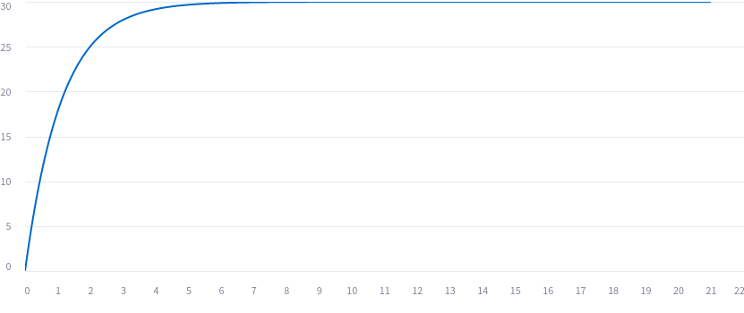
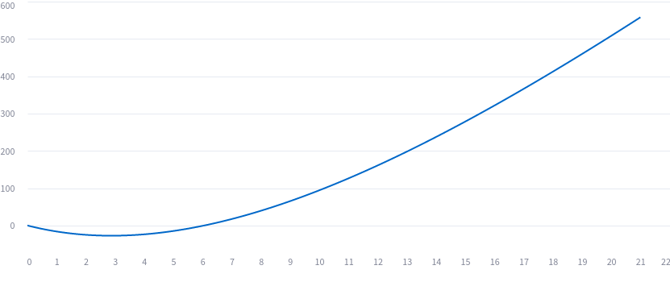

# About Controlling Fee Rates and P&L for Lightning Network Routing Nodes

**Work in Progress:** This peace of work should be interpreted as thoughts by
the author only. It probably still contains minor and possibly even major errors
at this stage.

Created by: feelancer21@github

## List of Contents

1. [Summary](#summary)
2. [About Arbitrage Freeness with Negative Forward Fees](#about-arbitrage-freeness-with-negative-forward-fees)
   1. [Arbitrage Freeness](#arbitrage-freeness)
3. [Modelling Outbound and Inbound Fee Rates with Margin and Liquidity Spread](#modelling-outbound-and-inbound-fee-rates-with-margin-and-liquidity-spread)
   1. [The Margin Spread Model](#the-margin-spread-model)
   2. [Rationale for Margin and Spread](#rationale-for-margin-and-spread)
      1. [Margin in Circular Case](#margin-in-circular-case)
      2. [Margin in Two Party Case](#margin-in-two-party-case)
      3. [Role of the Spread](#role-of-the-spread)
   3. [Practical setting](#practical-setting)
   4. [Explain the P&L of a Routing Node](#explain-the-pl-of-a-routing-node)
      1. [P&L Explain for Forwards](#pl-explain-for-forwards)
      2. [P&L Explain for Rebalancing Cost](#pl-explain-for-rebalancing-costs)
   5. [Margin Spread Model with #bLIP19 Inbound Fees](#margin-spread-model-with-blip19-inbound-fees)
5. [Modelling the Margin Rate with a Mean Reverting Controller](#modelling-the-margin-rate-with-a-mean-reverting-controller)

## 1. Summary

An approach for a more quantitative fee modelling for Lightning Network Routing
Nodes is presented which considers inbound and outbound fee rates as well. A 
great basic assumption of the approach is, that a competitive fee setting is good
for the network and that a node can incentivize inflows and outflows with their
fee settings. If a node is using its fees as opportunity costs for the calculation
of the fee limits, the fee settings influences also the rebalancing payments.
The incentivization can only work, if the remote side has healthy fee settings
too, at least in a certain range. If a node is working with high fee walls 
independent of the liquidity state of the channel and there are is no usage by the
sender then there is basically the question whether the channel is keeping it open.

The basic dynamic of the proposed model is very simple, lower the outbound fees 
and raising the inbound fees if liquidity is local and the other way around if
the liquidity is remote. But we are not modelling the fee rates directly, we 
model to components, called margin and spread, and derive the fee rates from this
components. Moreover introduce a five parameter model for the spread using 
exponential moving averages and for the margin a model having two parameters using
mean reversion. The automatic determination of an optimal parameterization would
be the subject of future research. However, it is theoretically already possible
to use the model with manual parameterization, provided that the dynamics of the
parameters are understood.

About the structure of the document

At first in Chapter 2 we show how we could introduce negative forward fees which
are compatible with [#bLIP18](https://github.com/lightning/blips/pull/18) using
the inbound fees. We show, when these are arbitrage free, that means an attacker 
cannot gain money by sending through a node because of the negative fees. Together
with the findings from chapter 3, we can conclude that the existence of a positive
margin is an important condition for this.

In Chapter 3 we show how to model margin rates and spread rates, and in a second
step we compose the fee rates using this information. This allows us also a better
explain of the actual P&L, because we can view on forwards as liquidity trades 
buying liquidity on the incoming, selling liquidity on the outgoing channel and
earning a margin. We show mathematically the decomposition for forwards fees and
for the rebalancing costs in two views, one which separates the margin of the 
source channel and one which separates the margin of the target channel. This could
allow node runners a more detailed explanation of its profit & losses on channel
level.

In Chapter 4 and 5 we present an approach of modelling the spread rates and margin
rates. The spread rates are adjusting using a kind of PID Controller, which 
increases the spread when the channel is depleted. Actually the spread rate 
controller uses an exponential moving for the integral, and an exponential decay
for the integral. This allows to express the controller as a continuous function 
of the current depletion and five parameters. The margin rate instead is controlled
by a mean reverting controller which converges smoothly to a given mean reversion
level by given speed.

We assume that all parameters for the controllers are externally given. But for an
automated node management we need also processes for the calibration of the
parameters. Some rough ideas are represented for further automatization are 
presented in section 6. The overall goal is to build a model which maximize the
returns of the node.

### 1.1. Comparison of the Dynamic Lndg Auto-Fees

We don't want to give a complete overview over the existing fee tools. But we 
can divide the existing algos in three main categories.

1. **static**: The fee rates are constant and until the node operator changes the
configuration.
2. **semi-dynamic**: The fee rates are a function of the current state if a channel
or all channels with one peer, e.g. a function of the current local balances. The 
same at different times implies the same fee rates. An example for this are 
proportional or other balance dependent configurations with charge-lnd.
3. **dynamic**: Dynamic algos are not only a function of the current channel state,
they take also the historic evolvement into account. The main difference to the 
semi-dynamic is, that the same state to a different time can lead to different fee
rates.

One example of dynamic fee algorithm are the Auto-Fees implemented in
[Lndg](https://github.com/cryptosharks131/lndg/tree/11aa6f8f78dad0e499564343967f3cde551f7da9?tab=readme-ov-file#auto-fees),
which we'd like to compare with the dynamic of our proposed spread rate controller.
We want to focus on the part where Lndg decreases the fees if the local liquidity
goes above a given `ExcessLimit`
([Code](https://github.com/cryptosharks131/lndg/blob/11aa6f8f78dad0e499564343967f3cde551f7da9/af.py#L99-L104))
and discuss two differences:

## 2. About Arbitrage Freeness with Negative Forward Fees

We'd like to introduce the whole theory in a world where negative forward where
negative forward fees are possible, introducing them as inbound fee which 
overpays the outbound fees. In the review process of 
[#6703](https://github.com/lightningnetwork/lnd/pull/6703#pullrequestreview-1671366066),
there was a discussion about allowing overall negative forward fees.
At that point, it seemed better to prevent node runners from losing money by not
allowing this feature.

We want to introduce a concept of arbitrage freeness here which prevents that an
attacker can extract money from a node with just sending sats back and forth,
because of bad relationships between inbound and outbound fees.

Let $c$ be a channel policy, $r_{c,i}$, $r_{c,o}$ the inbound and outbound fee
rates in decimals (e.g., 1000ppm = 0.001), $b_{c,i}$, $b_{c,o}$ the base fees in
msat. All information are represented as a vector $c=(r_{c,o},b_{c,o}, r_{c,i},
b_{c,oi})^T$ and $c\in C$ with the policy space 
$C=\mathbb{R}_{\ge 0}\times\mathbb{R}_{\ge 0}\times\mathbb{R}\times\mathbb{R}$.

The function

$$ f_{c,o}(x):= (1+r_{c,o})\cdot x+ b_{c,o} $$

calculates the amount to receive from an amount to send using the outbound fees 
of the channel $c$. The function

$$ f_{c,i}(x):= (1+r_{c,i})\cdot x + b_{c,i} $$

calculates the amount to send from an amount to receive using the inbound fees of
the channel $c$. This function is only valid with negative forward fees. At the
moment the inbound fees are floored by the next outbound fee. i.e. the function is

$$ \tilde{f}_{c,i}(x):= x + \max(r_{c,i}\cdot x + b_{c,i}; -k) = \max((1+r_{c,i})
\cdot x + b_{c,i};x-k) = \max(f_{c,i}(x),x-k)$$

with the previous outbound fee $k$.

With negative forward fees it can happen, that $f_{c,i}(x)<0$ for small amounts 
of $x$ if there is a negative inbound base fee $b_{c,i}$. Economically that would 
mean, that the routing node is able to pay an amount to the sender of the payment.
We will assume that $f$ becomes to

$$ \bar{f}_{c,i}(x) = \max((1+r_{c,i})\cdot x + b_{c,i}, 0) = \max(f_{c,i}(x),0)$$

for upcoming proofs. Moreover we want to assume, that there is no upper limit 
for the amount $x$, i.e. no constraints by channel capacity or max htlc amounts.

For each possible representation of $f$ we can see that $f_{c,i}(x+\Delta) \ge 
f_{c,i}(x)$ for $x, \Delta\ge 0$, because $f_{c,i}(x+\Delta)=f_{c,i}(x)+\Delta(1
-r_{c,i})$ and the last summand is positive because we can assume $r_{c,i}\ge -1 = -100$%.

### 2.1. Arbitrage Freeness

To introduce the concept of **arbitrage freeness** we want to analyze when the 
following attack doesn’t lead to a profit for the attacker. We assume that the 
attacker controls all nodes of the channel's parties, hence they can send sats 
from one node to another without incurring additional hop costs. The attacker 
chooses an arbitrary sequence of channels with policies $c_1, \dots, c_n$ with 
$n\ge 2$ and $c_1=c_n$. They send an amount $x_1$ from $c_1$ to $c_2$, so they 
receive $x_2$ in $c_2$. They proceed by sending $x_2$ from $c_2$ to $c_3$, 
receiving $x_3$, etc. Our goal is to ensure that they don't receive more than 
they pay, i.e. $x_1\ge x_n$.

We say a channel policy $c$ is **weak arbitrage free** if an attacker cannot gain
money with a self payment in the same channel, i.e it is not possible sending 
$x_1$ in the channel and receiving $x_2$ with $x_2>x_1$.

**Lemma:** Under the given assumptions, a channel policy $c$ is weak arbitrage 
free if and only if

$$ f_{c,io}(x):=(f_{c,i}\circ f_{c,o})(x) \ge x $$

for all $x$. The condition is full filled if both conditions hold

- $r_{c,o} + r_{c,i}+r_{c,o}\cdot r_{c,i}\ge 0$
- $b_{c,o} + b_{c,i} + b_{c,o}\cdot r_{c,i}\ge 0$

**Proof:** We set $c=c_1=c_2$, i.e. an attacker makes a circular payment in the 
same channel, sending $x_1$ in the channel and receiving $x_2$ with 
$x_1=f_{c,i}(f_{c,o}(x_2))=f_{c,io}(x_2)$. Hence $x_1=f_{c,io}(x_2)\ge x_2$ is 
necessary and sufficient for each $x_2$.

Moreover we have

$$ f_{c,io}(x) = x + (r_{c,o}+r_{c,i}+r_{c,o}\cdot r_{c,i})\cdot x + b_{c,o} + 
b_{c,i} + b_{c,o}\cdot r_{c,i} $$

and if both inequalities hold, the value of the function is $\ge x$ for all $x$. 
And if we use $\tilde{f}_i$ or $\bar{f}_i$ instead of $f_i$ the value of the 
function even only becomes higher. $\Box$

At this point we cannot say whether an attacker can gain money if the channel 
policy $c$ is used in combination with other policy. That's why we want to 
introduce the concept of **strong arbitrage freeness (SAF)** which is a property
of a subset $\tilde{C}\subseteq C$. We say $\tilde{C}$ is SAF if for any 
sequence $c_1,\dots,c_{n-1}$ with $c_i\in\tilde{C}$ and any amount $x$

$$ ((f_{c_{1},i}\circ f_{c_2,o})\circ\dots\circ(f_{c_{n-2},i}\circ f_{c_{n-1},o})
\circ(f_{c_{n-1},i}\circ f_{c_{1},o}))(x)\ge x$$

In other words: the attacker cannot gain money by sending an arbitrary amount 
along an arbitrary channel sequence.

If a set is SAF, then every subset is it too, because every policy sequence of 
elements of the subset is also a sequence of elements of the upper set. This 
leads us to the question if we can define a maximum set $C_A$ which is SAF, i.e. 
there is no other set $\tilde{C}$ which is SAF and $C_A\subset\tilde{C}$

For the next lemma we define another composition $f_{c,oi}:=f_{c,o}\circ f_{c,i}$

**Lemma:** $C_A := \{c\in C\ |\ \forall x\ge 0,\ f_{c,oi}(x)\ge x \ \wedge\ f_{c,io}
(x)\ge x \}$ is the maximum set which is SAF.

**Proof:** The first part is taking an arbitrary set $\tilde{C}$ being SAF and 
showing that every channel policy $c\in\tilde{C}$ is also in $C_A$. As second part
we show that the whole constructed set $C_A$ is still SAF.

*Part 1:* First step is to realize that the zero channel policy $c_0=(0,0,0,0)^T$
can be used to construct a SAF by $C_0=\{c_0\}$, because by definitions we have 
$f_{c_0,io}(x)=f_{c_0,oi}(x)=x$ and hence each composition leads to the identity 
which satisfies the SAF condition for each $x$.

Second if we have a SAF set $\tilde{C}$ which doesn't include $c_0$, then 
$\tilde{C}\cup \{c_0\}$ is also SAF. This can be shown by taking an arbitrary 
policy sequence out of $\tilde{C}$ and if we enrich this sequence with $c_0$, then 
the SAF definition still holds, because the identity function don't change the 
forward fees.

Third let $c\in\tilde{C}$ a policy of an arbitrary SAF set. By definition of SAF,
$c$ alone has to satisfy $f_{c,io}(x)\ge x$ for all $x$. Moreover $C_c:=\{c_0,c\}$ 
is SAF by the rationale mentioned previously. But then we can follow from the SAF 
definition that we are also safe against an attacker sending in an amount in the 
channel with policy $c_0$ to the channel with policy $c$ and back. Because of

$$ ((f_{c_0,i}\circ f_{c,o}) \circ(f_{c,i}\circ f_{c_0,o}))(x) = (f_{c,o}\circ 
f_{c,i})(x) = f_{c,oi}(x)$$

we have shown that $f_{c,oi}(x)\ge x$ for all $x$, and hence $c\in C_A$.

*Part 2:* Let $c_1,\dots,c_n$ be a sequence with $c_i\in C_A$, we have to show 
that for all x

$$ x_1 = ((f_{c_{1},i}\circ f_{c_2,o})\circ\dots\circ(f_{c_{n-2},i}\circ f_{c_{n-1}
,o})\circ(f_{c_{n-1},i}\circ f_{c_{1},o}))(x)\ge x$$

hold.

Choosing an arbitrary amount $x_n\ge 0$ and using the fact that composition is 
associative, we have:

$$ x_1 = (f_{c_{1},i}\circ (f_{c_2,o}\circ f_{c_2,i})\circ\dots\circ(f_{c_{n-1}
,o}\circ f_{c_{n-1},i})\circ f_{c_{n},o})(x_n) $$

This leads, by our definitions, to:

$$ x_1 = (f_{c_{1},i}\circ (f_{c_2,oi}\circ\dots\circ f_{c_{n-1},oi})\circ 
f_{c_{1},o})(x_n) $$

If we assume that $f_{c,oi}(x)\ge x$ for each channel $c$ and every possible 
amount $x$, then the inequality also holds for any composition of such functions 
in sequence. As consequence there exists a $\Delta\ge 0$ such that:

$$ (f_{c_2,oi}\circ\dots\circ f_{c_{n-1},oi}) (f_{c_{1},o}(x_n))=f_{c_{1},o}(x_n)+\Delta $$

As already seen, for any $x, \Delta\ge 0$ we have $f_{c,i}(x+\Delta) \ge 
f_{c,i}(x)$ and hence:

$$ x_1 = f_{c_{1},i}(f_{c_{1},o}(x_n)+\Delta) \ge f_{c_{1},i}(f_{c_{1},o}(x_n))
= f_{c_{1},io}(x_n) $$

Because of $C_A$ definition we have $f_{c,io}(x)\ge x$ for each channel $c$ and 
any amount $x$, and hence $x_1\ge f_{c_{1},io}(x_n)\ge x_n$, proofing that $C_A$ 
is SAF. $\Box$

**Corollary:** The set of channel policies which where the parameters satisfy the 
following restrictions is denoted by $C_R$:

1. $r_{c,o} + r_{c,i}+r_{c,o}\cdot r_{c,i}\ge 0$
2. $b_{c,o} + b_{c,i} + b_{c,o}\cdot r_{c,i}\ge 0$
3. $b_{c,o} + b_{c,i} + b_{c,i}\cdot r_{c,o}\ge 0$

$C_R$ is SAF.

**Proof:** Independently whether we which function we use for $f_i$: 
$\tilde{f}_i$, $\bar{f}_i$ or $f_i$ itself we can say that

$$ f_{c,io}(x) \ge x + (r_{c,o}+r_{c,i}+r_{c,o}\cdot r_{c,i})\cdot x + b_{c,o} + 
b_{c,i} + b_{c,o}\cdot r_{c,i} $$

$$ f_{c,oi}(x) \ge x + (r_{c,o}+r_{c,i}+r_{c,o}\cdot r_{c,i})\cdot x + b_{c,o} + 
b_{c,i} + b_{c,i}\cdot r_{c,o} $$

And with the given assumptions both right hand sides are $\ge 0$, which implies 
the SAF.

**Remark:** We can also say that $C_R\subseteq C_A$, e.g. if we only work with 
policies without base fees and without flooring the fees at outbound fees.

## 3. Modelling Outbound and Inbound Fee Rates with Margin and Liquidity Spread

### 3.1. The Margin Spread Model

Assume that for a specific channel $c$ there are two given variables: a 
non-negative margin rate $m_c$ and a liquidity spread rate $s_c$, which can both 
be real numbers. We like to set the outbound and inbound fee rates with this 
known information.

If $m_c+s_c\ge 0$, we set

$$
\begin{aligned}
r_{c,o}&=\frac{1}{1-s_c}\cdot(m_A+ s_c)\\
r_{c,i}&=-s_c
\end{aligned}
$$

A continuous prolongation of these functions for the case $m_c+s_c< 0$ is

$$
\begin{aligned}
r_{c,o}&=0\\
r_{c,i}&=m_c
\end{aligned}
$$

We can also consolidate the two blocks into one, by introducing 
$\tilde{s_c}:=s_c$ if $s_c+m_c\ge 0$ and $\tilde{s_c}:=-m_c$ if $s_c+m_c< 0$, and 
set

$$
\begin{aligned}
r_{c,o}&=\frac{1}{1-\tilde{s_c}}\cdot(\tilde{s_c}+m_c)\\
r_{c,i}&=-\tilde{s_c}
\end{aligned}
$$

This makes the following proofs easier because we only have to care about one case.

### 3.2. Rationale for Margin and Spread

#### 3.2.1. Margin in Circular Case

But why does it make sense to call the two variables margin and spread? Let's 
have a look at a circular payment with channel policy $c$ first. Assuming there 
are no restrictions for the incoming fees, the net earnings of such a payment can 
be calculated by

$$ E(x) = f_{c,oi}(x)-x = ((1+r_{c,o})\cdot(1+r_{c,i})-1)\cdot x + B(x)$$

with a residual $B(x)$ driven by the base fees, which we want to ignore for now. 
With

$$
(1+r_{c,o})\cdot(1+r_{c,i})-1=\left(1+\frac{1}{1-\tilde{s_c}}\cdot(m_c+ 
\tilde{s_c})\right)\cdot(1-\tilde{s_c})-1=m_c
$$

Hence, a node runner earns a margin amount that scales by the margin rate $m_c$. 
Ignoring the $B(x)$, the spread has no influence on the earnings.

Moreover,

$$
m_c=(1+r_{c,o})\cdot(1+r_{c,i})-1=r_{c,o} + r_{c,i}+r_{c,o}\cdot r_{c,i}
$$

That's why we can replace the first inequality for checking $c\in C_R$ by the 
margin rate:

**Corollary:** Given a channel policy $c$, we have $c\in C_R$ if $m_c\ge 0$ and 
the second and third inequality are satisfied.

#### 3.2.2. Margin in Two Party Case

Now, look at the case where two channels with policies $c_1$ and $c_2$ are 
involved. At first, we have forwards from $c_1$ to $c_2$ and afterwards in the 
other direction. Also, assuming there are no restrictions of the incoming fees, 
the earnings are given by

$$
E(x)=(f_{c_1,i}\circ f_{c_2,o}\circ f_{c_2,i}\circ f_{c_1,o})(x)-x=((1+r_{c_1,i})
\cdot(1+r_{c_2,o})\cdot (1+r_{c_2,i})\cdot(1+r_{c_1,o})-1)\cdot x + B(x)
$$

and after some algebra, we have

$$
E(x)=((1+m_{c_1})\cdot (1+m_{c_2})-1)\cdot x + B(x)
$$

What we see here is a compounding of the margin rates, and that the spread has 
no influence on the earnings if we ignore the term $B(x)$.

#### 3.2.3. Role of the Spread

As we have seen, the spread has no influence on the earnings, but this is only 
half the truth because the spread basically determines our price for the liquidity,
either by rebalancing or by incoming forwards. A lower spread makes it harder to 
incentivize inbound liquidity, because the inbound fee rate is also lower in this 
case. Moreover, if one uses the outbound fee rates as opportunity costs for 
rebalancing, a lower spread implies a lower outbound fee rate and hence also a 
lower rebalancing budget.

On the other hand, a higher spread makes it easier to acquire inbound liquidity, 
but the outbound fee rates are also higher, which can restrict outgoing forwards 
in the channel.

We can conclude that the spread rate is more of a liquidity price, which 
influences the forwarding volume of a channel, and the forwarding volume 
influences the margin we can earn.

Also, the volatility of the spread is important. If the volatility is higher, 
i.e., one increases the spread fast if the liquidity is remote and decreases the 
spread fast if the liquidity is local, then it can happen that one buys liquidity 
at prices being not able to sell. This influences the total profits, because now 
one has a negative impairment effect driven by the spread rates. Per se, 
volatility isn't a bad thing, because it could also lead to higher volume on the 
node. The question is more about what the optimal ratio between volatility and 
total profits is.

### 3.3. Practical Setting

The model will help us later to understand what the origins of the P&L of a 
routing node are. And if we are able to model the margin and the liquidity, we 
can set the fee rates immediately. But in practice, we cannot set the fee rates 
to real numbers, and maybe we will not broadcast each changed ppm to the network. 
That's why we will introduce residuals $\epsilon_{c,o}$ and $\epsilon_{c,i}$, 
which are the results of rounding and other practical constraints. Moreover, in 
practice, the factor $\frac{1}{1-\tilde{s_c}}\sim1$. We will set the factor to 1 
and put the difference in $\epsilon_{c,o}$.

Summarizing:

$$
\begin{aligned}
r_{c,o}&=\tilde{s_c}+m_A+\epsilon_{c,o}\\
r_{c,i}&=-\tilde{s_c}+\epsilon_{c,i}
\end{aligned}
$$

### 3.4. Explain the P&L of a Routing Node

#### 3.4.1 P&L Explain for Forwards

We denote the fee a sender wants to pay us with $f$ for a forward incoming in the 
channel $A$ with Alice and outgoing in the channel $B$ with Bob. $f(x)=x\cdot((1+
r_{B,o})\cdot(1+r_{A,i})-1)+b_{B,o}\cdot(1+r_{A,i})+b_{A,i}$ is a function 
calculating the theoretical fee if there is no floor of at 0 by a given outgoing 
amount of $x$. Our goal is to build two views, one which separates the margin 
amount of channel $A$, and one which extracts the margin amount of channel $B$.

##### Forwards: Separation of the Source Margin

Moreover, there is the identity

$$
\begin{aligned}
& x\cdot((1+r_{B,o})\cdot(1+r_{A,i})-1) = x\cdot(r_{B,o}+r_{A,i}+r_{B,o}\cdot 
r_{A,i}) \\
=& x\cdot r_{B,o} + (x+f)\cdot r_{A,i} + x\cdot r_{B,o}\cdot r_{A,i} -f\cdot 
r_{A,i}.
\end{aligned}
$$

If we also consider that

$$
\begin{aligned}
r_{A,i}&=-\tilde{s_A}+\epsilon_{A,i}=-(\tilde{s_A}+m_A+\epsilon_{A,o})+m_A+(\epsilon_{A,i}+\epsilon_{A,o})\\
&=-r_{A,o}+m_A+(\epsilon_{A,i}+\epsilon_{A,o})
\end{aligned}
$$

we can decompose our total fee into seven parts

$$
\begin{aligned}
f  &= \sum_i f_i \\
f_1 &= f - f(x)^+ \\
f_2 &= f(x)^+ -f(x) \\
f_3 &= b_o\cdot(1+r_i)+b_i \\
f_4 &= (x+f)\cdot m_A \\
f_5 &= -(x+f)\cdot r_{A,o} \\
f_6 &= x\cdot r_{B,o} \\
f_7 &= x\cdot r_{B,o}r_{A,i} -f\cdot r_{A,i} + (x+f)\cdot(\epsilon_{A,i}+
\epsilon_{A,o}).
\end{aligned}
$$

Let's explain the several components:

1. $f_1$ is an overpayment between the actual fee and the theoretical fee based 
   on the formulas of bLIP18 considering a floor of the fee at 0, which is the 
   current lnd implementation. Such an overpayment can happen if the payer is not 
   aware of lower fees or cannot use the inbound discounts.
2. $f_2$ is an unexpected margin, which usually occurs when $(1+r_{B,o})\cdot(1+
   r_{A,i})<1$, i.e., the outbound fee is lower than the inbound discount. This 
   is the case if we have a forward from a node which is more a sink to a node 
   which is more a source. That's why this type of earning is not a usual one and 
   should be separated from regular margins. Moreover, if we had negative forward 
   fees, we could also aggregate $f_1$ and $f_2$ into one overpayment.
3. $f_3$ is the base margin, the net amount fees from the specified base fees.
4. $f_4$ is the margin amount using Alice's margin rate. It scales with the 
   received incoming forwarding amount.
5. While all components up to $f_4$ had an earnings character, $f_5$ and $f_6$ 
   have more of a character of purchasing costs and selling proceeds of a fee 
   potential. We have received liquidity of an amount of $x+f$ in the channel of 
   Alice. If we are able to sell it to another source, we can earn $(x+f)\cdot 
   r_{A,o}$, and if we assume that the rate of $r_{A,o}$ is a market-conform rate, 
   then $f_5$ represents the purchasing costs for the fee potential.
6. On the other hand, we received $f_6$ for selling the liquidity to Bob.
7. $f_7$ is a residual P&L. It consists of many second-order terms.

The concept of 'fee potential' was introduced by 
[DerEwige](https://github.com/DerEwige/speedupln.com/blob/main/docs/fee_potential_and_rebalancing.md). 
It is basically the product of the fee rate and its potential fees to earn. 
According to it, we can also define a spread potential for spread rates and a 
margin potential for margin rates.

Because of the purchasing and selling fee potentials, we have to think about 
routing more as liquidity trading. But $f_5$ and $f_6$ do not cause P&L directly. 
P&L is caused by the other components. There is only a P&L effect from the fee 
potential if the fee rates changed between purchasing and selling the potential.

##### Forwards: Separation of the Target Margin

But we can also derive another decomposition that separates the margin of the 
target channel of Bob. With

$$
\begin{aligned}
r_{B,o} &= (\tilde{s_B}+\epsilon_{B,o})+m_B \\
r_{A,i} &= -(\tilde{s_A}+\epsilon_{A,o})+(\epsilon_{A,i}+\epsilon_{A,o})
\end{aligned}
$$

we decompose $f$ into

$$
\begin{aligned}
f  &= \sum_i f_i \\
f_1 &= f - f(x)^+ \\
f_2 &= f(x)^+ -f(x) \\
f_3 &= b_o\cdot(1+r_i)+b_i \\
f_4 &= x\cdot m_B \\
f_5 &= -(x+f)\cdot (\tilde{s_A}+\epsilon_{A,o}) \\
f_6 &= x\cdot (\tilde{s_B}+\epsilon_{B,o}) \\
f_7 &= x\cdot r_{B,o}r_{A,i} -f\cdot r_{A,i} + (x+f)\cdot(\epsilon_{A,i}+
\epsilon_{A,o}).
\end{aligned}
$$

$f_1$, $f_2$, $f_3$, and $f_7$ haven't changed. But now:

4. $f_4$ is the margin amount of Bob, which scales with the outgoing amount $x$.
5. $f_5$ and $f_6$: Now the liquidity trade isn't about the fee potential. It is 
   only about the spread potential (and the epsilons). But forwarding can still 
   be interpreted as a trade of liquidity.

Now we have two decompositions, one extracting the margin of the incoming channel 
and one extracting the margin of the outgoing channel. Then, any convex 
combination is a decomposition, e.g., choosing 50% of each.

#### 3.4.2. P&L Explain for Rebalancing Costs

In the context of rebalancing costs, we also want to decompose the rebalancing 
costs in two views.

Our rebalancing is from our source channel $A$ with Alice to channel $B$ with Bob, 
and it costs an amount of $c<0$ in sats. Of course, in the context of negative 
forward fees in the future, we want to take into account the case of $c>0$, e.g., 
if one rebalances from a sink to a source. Effectively, rebalancing for a routing 
node is also a liquidity trade, better described as a liquidity arbitrage trade. 
It involves selling liquidity in channel $A$ and buying liquidity in channel $B$.

##### Rebalancing: Separation of the Benefit in the Source Margin

$$
\begin{aligned}
c &= \sum_i c_i \\
c_1 &= (x+c)\cdot r_{A,o} \\
c_2 &= -x\cdot r_{B,o} \\
c_3 &= m_B\cdot (x+f_B)-m_A\cdot (x+f_A)\\
c_4 &= c-c_1-c_2-c_3
\end{aligned}
$$

1. $c_1$ is the virtual amount received for selling the fee potential in the 
   channel with Alice.
2. $c_2$ is the virtual amount paid for buying the fee potential in the channel 
   with Bob.
3. $c_3$ is the advantage we have in the margin for forwarding from Alice to Bob 
   compared to a forward from Bob to Alice. $f_A$ and $f_B$ are the hypothetical 
   fees for these forwards to calculate the correct incoming amount in the two 
   channels. Let's say $A$ and $B$ have nearly identical fee rates such that 
   $c_1+c_2=0$. It is only beneficial to rebalance in this case if we earn more 
   margin from Alice to Bob than from Bob to Alice, i.e., if $c>c_3$.
4. $c_4$ is the difference of $c_1$ to $c_3$ to the actual paid fee $c$. It is 
   basically our rebalancing margin, and rebalancing is only beneficial if 
   $c_4>0$.

##### Rebalancing: Separation of the Benefit in the Target Margin

The next step is building a decomposition that separates the margin benefit of 
the target channel.

$$
\begin{aligned}
c &= \sum_i c_i \\
c_1 &= (x+c)\cdot (\tilde{s_A}+\epsilon_{A,o}) = (x+c)\cdot r_{A,o} - (x+c)\cdot 
m_A \\
c_2 &= -x\cdot (\tilde{s_B}+\epsilon_{B,o}) = -x\cdot r_{B,o} + x\cdot m_B\\
c_3 &= m_A\cdot (x+f_A)-m_B\cdot (x+f_B) \\
&= m_B\cdot (x+f_A)-m_A\cdot (x+f_B) +2\cdot (m_A\cdot (x+f_A)-m_B\cdot 
(x+f_B))\\
c_4 &= c-c_1-c_2-c_3
\end{aligned}
$$

We can interpret the components as in the previous decomposition, with the 
difference that now only the spread potentials (and the epsilons) are traded and 
not the whole fee potentials.

#### Adjustments of the Potentials

We have seen that in the decomposition of the earnings and the costs, implicit 
buys and sells of liquidity to the price of the fee rates or spread rates are 
included. But these rates have to be the current rates at the time of the trade. 
However, the rates can change, e.g., between buying the liquidity with a 
rebalancing payment and selling it with a forward. If a node had to lower their 
fees in between, there is an additional negative P&L component, which is not 
included in the above-mentioned components. These additional value adjustments 
could be calculated with an additional process that revalues the fee potentials 
at defined time intervals.

1. For time $T_{n-1}$, we know the potential of the fees, spreads, or margins.
2. We determine the current potentials at time $T_n$ by multiplying the current 
   balance with the current fees, spreads, or margins.
3. We determine the net balance of bought liquidity and sold liquidity in between 
   for fees, spreads, or margins.
4. Now we can compare the sum of 1. and 3. with 2. If the sum is lower, then we 
   have a negative value adjustment, which is effectively a loss for the node. If 
   it is higher, then there is an additional gain.

### 3.5. Margin Spread Model with #bLIP19 Inbound Fees

There is a different proposal for inbound fees with 
[#bLIP19](https://github.com/lightning/blips/pull/22). The main idea is that a 
node communicates the inbound fee to the peer, and it increments its outbound fee.

> MUST ensure it's next `channel_update` message for the corresponding channel 
> has its `fee_proportional_millionths` and `fee_base_msat` fields incremented by 
> the `inbound_forwarding_fee_proportional_millionths` and 
> `inbound_forwarding_fee_base_msat` fields, respectively. Fields which fall 
> below zero MUST be set to zero.

The floor at zero would make it impossible to use the proposed margin spread 
model with such inbound fees because the inbound discounts would be limited by 
the outbound fees of the peer.

Hence, the proposed margin spread model could not fully be used with #bLIP19 
inbound fees.

## 4. Modelling the Spread Rate with Exponential Moving Averages

### Basics

The model for the spread rate is based on the idea of PID (Proportional-Integral-
Derivative) controllers. PID controllers utilize a measured process variable, 
compare it to a target value, and calculate an error function, denoted as $e(t)$. 
They use a linear function to adjust the control variable based on the error, 
its integral over time, and its derivative, aiming to minimize the error in 
subsequent iterations.

We are not using classical integrals and derivatives. Instead, an exponential 
weighted moving average with a smoothing parameter ($\alpha_i$) defines the 
implicit length of the error history. Additionally, an exponential decay with a 
parameter ($\alpha_d$) is applied to the error delta as a derivative component. 
You can also specify a drift for adjustments that scale over time but are not 
influenced by the error.

For calculating the error, the remote balance is compared to a target value, 
typically derived from the average liquidity ratio of all channels. The 
difference between the observed remote balance and the target is mapped to an 
error ($e$) in the range [-0.5, 0.5] using linear interpolation. When the remote 
balance equals the target, $e$ is set to 0.

### Modelling the Spread with a PID Controller

Let $T$ be the current time, and $T_0$ represent the oldest observed historic 
timestamp.

Our approach is based on control theory, i.e., we have a system with a time-
dependent input function, our error function $e(t)$. The system returns a time-
dependent output $y(t)$, which is the marginal increase of the spread rate. 
Hence, we can model the spread rate by the following differential equation:

$$
ds(t) = y(t)dt
$$

This equation leads to:

$$
s(T_n) = s(T_{n-1}) + \int_{T_{n-1}}^{T_n}y(t)dt
$$

The system output $y(t)$ itself is a linear combination of several parts:

$$
y(t)=K_p\cdot e(t) + K_i\cdot E_{\alpha_i}(t) +K_d\cdot D_{\alpha_d}(t)
$$

The functions $E_\alpha$ and $D_\alpha$ are defined later. Our goal is that they 
have the following properties: while the first summand scales with the current 
value of the error function, the second summand should scale with an exponential 
moving average $E_{\alpha_i}(t)$ over a longer time horizon. $\alpha_i$ serves 
as a smoothing parameter for controlling the implicit length of the history. 
The third summand should scale with the recent changes in the error function. 
But we don't want to apply the whole changes immediately. Instead, we want to 
decay the changes smoothly with an exponential function $D_{\alpha_d}(t)$ 
parametrized by a smoothing parameter $\alpha_d$ for the implicit decay period.

Overall, the model has five parameters that need to be calibrated. For the next 
sections, we assume the parameters as externally given.

Our goal is now to find a recursive representation of the following integral, 
which allows us to update the controller incrementally:

$$
\int_{T_{n-1}}^{T_n}y(t)dt=K_p\int_{T_{n-1}}^{T_n} e(t)dt + K_i\int_{T_{n-1}}^
{T_n}E_{\alpha_i}(t)dt +K_d\int_{T_{n-1}}^{T_n} D_{\alpha_d}(t)dt
$$

Now, let's delve into the different parts. We will assume that the error function 
$e(t)$ is piecewise linear over $t \in]T_{n-1}, T_{n}]$, i.e.,

$$
e(t)=\beta_1\cdot (t-T_{n-1}) + \beta_0,\ \beta_1=\frac{e(T_n)-e(T_{n-1})}
{T_n-T_{n-1}},\ \beta_0=e(T_{n-1})
$$

#### Proportional Part

This part is relatively straightforward:

$$
\begin{aligned}
K_p \int_{T_{n-1}}^{T_n} e(t)dt &= K_p\cdot (T_n - T_{n-1}) \cdot\left(\frac{m}
{2}\cdot (T_n - T_{n-1})+\beta_0\right) \\
&= K_p\cdot (T_n - T_{n-1}) \cdot \frac{e(T_n)+e(T_{n-1})}{2}
\end{aligned}
$$

The outcome of the controller scales with the average error of the time period.

#### Exponential Decay of a Function

Before we go into the concrete definition of our integral and derivative part, 
some general remarks about the decay of functions: given an integrable input 
function $x(t)$ (which will later be the error $e(t)$ or the derivative of it) 
and a parameter $\alpha$, we define a weight function $W_{x,\alpha}(t)$ by

$$
W_{x,\alpha}(t) := \int^t_{T_o} x(\tau)\cdot \alpha\cdot \exp\left(\alpha (\tau 
- t)\right)d\tau
$$

and with $h_\alpha(t)=\alpha\exp(-\alpha t)$, we have

$$
W_{x,\alpha}(t) := \int^t_{T_o} x(\tau)\cdot h_\alpha(t-\tau)d\tau
$$

which is a convolution integral over the local area $[T_0;t]$. This fact is not 
relevant now but might be interesting for future analysis of the controller.

Now, given $T_{n-1}>T_0$, we want to express $W_{h,\alpha}(t)$ for $t>T_{n-1}$ 
recursively using $W_{h,\alpha}(T_{n-1})$. It becomes:

$$
\begin{aligned}
W_{x,\alpha}(t) &=  \int^t_{T_{n-1}} x(\tau)\cdot \alpha\cdot \exp\left(\alpha 
(\tau - t)\right)d\tau + \exp(\alpha(T_{n-1}-t)) \int^{T_{n-1}}_{T_o} x(\tau)
\cdot \alpha\cdot \exp\left(\alpha (\tau - T_{n-1})\right)d\tau \\
&=\int^t_{T_{n-1}} x(\tau)\cdot \alpha\cdot \exp\left(\alpha (\tau - t)\right)
d\tau + \exp(\alpha(T_{n-1}-t))\cdot W_{x,\alpha}(T_{n-1})
\end{aligned}
$$

#### Integral Part

For calculating the integral part, we apply our piecewise linear-defined error 
function $e(t)$ to $W_x$ as $x(t)$.

Our weight function will lead to an exponential weighted moving average, which 
we define by

$$
E_{\alpha}(t):=W_{e,\alpha}(t)
$$

and with the assumption for $e(t)$, we have to solve

$$
E_\alpha(t) = \int^{t}_{T_{n-1}} \alpha \exp\left(\alpha (\tau - t)\right)\cdot
(\beta_1\cdot \tau+\beta_0) \cdot d\tau + \exp\left(\alpha (T_{n-1} - t)\right) 
\cdot E_\alpha(T_{n-1})
$$

and the solution is

$$
E_\alpha(t) = e(t) -\frac{\beta_1}{\alpha} + \exp\left(\alpha (T_{n-1} - t)
\right) \cdot \left( E_\alpha(T_{n-1}) + \frac{\beta_1}{\alpha} -\beta_0 \right)
$$

Now we can set the integral part of the controller as:

$$
\begin{aligned}
& K_i \int^{T_n}_{T_{n-1}} E_\alpha(t) dt \\
=& K_i \left((T_n - T_{n-1})\cdot\left(\frac{e(T_n)+e(T_{n-1})}{2} -\frac{\beta_1}
{\alpha}\right)+ \frac{1}{\alpha}(1 - \exp(\alpha (T_{n-1} - T_n))) \cdot\left(
E_\alpha(T_{n-1}) +\frac{\beta_1}{\alpha}- \beta_0\right)\right)
\end{aligned}
$$

This allows us to update the controller recursively with only the knowledge of 
the value of $E_\alpha(T_{n-1})$.

#### Derivative Part

For the derivative part, we are using the partial derivative $\frac{\partial e}
{\partial\tau}$ for $x(t)$. Hence, we have to solve

$$
D_\alpha(t) := W_{\frac{\partial e}{\partial\tau},\alpha}(t)= \int^{t}_{T_{n-1}} 
\alpha \exp\left(\alpha (\tau - t)\right)\cdot \beta_1 \cdot d\tau + \exp\left(
\alpha (T_{n-1} - t)\right) \cdot D_\alpha(T_{n-1})
$$

and the solution is

$$
D_\alpha(t) = \beta_1 + \exp\left(\alpha (T_{n-1} - t)\right) \cdot \left( 
D_\alpha(T_{n-1}) - \beta_1 \right)
$$

Now we can set the derivative part of the controller as:

$$
\begin{aligned}
& K_d \int^{T_n}_{T_{n-1}} D_\alpha(t) dt \\
=& K_d \left(e(T_n) - e(T_{n-1}) + \frac{1}{\alpha}(1 - \exp(\alpha (T_{n-1} - 
T_n))) \cdot\left(D_\alpha(T_{n-1}) - \beta_1\right)\right)
\end{aligned}
$$

This also allows us to update the controller recursively.

### Behavior after a Simple Impulse

To show the dynamics of the spread controller, we want to investigate its long-
term behavior after a simple impulse. At $T_0=0$, we set $s(T_0)=0$ and $e(T_0)=e_1$, 
and for $t\ge T_1=1$, we observe $e(t)=e_1$. We want to determine an analytical 
function for the spread $s(T)$ for $T\ge T_1$ based on our derived formulas. 
For $t\in]0;1]$, we have $\beta_1=e_1-e_0$ and $\beta_0=e_0$; for $t>1$, we have 
$\beta_1=0$ and $\beta_0=e_0$. The other five model parameters are chosen 
arbitrarily.

First, we want to show how $E_\alpha(t)$ evolves if there is no change in the 
error from $T_1$. For $t>T_1$, we get:

$$
\begin{aligned}
E_\alpha(t) &= e(t) -\frac{\beta_1}{\alpha} + \exp\left(\alpha (T_1 - t)\right) 
\cdot \left( E_\alpha(T_1)  -e_1 \right)
\end{aligned}
$$

Because the second summand goes to zero for $t\rightarrow\infty$, we have 
$E_\alpha(t)$ converging to $e_1$, and hence the contribution of the integral 
part for time intervals with large values of $T_{n-1}$ and $T_n$ is nearly 
$K_i\cdot (T_n-T_{n-1})\cdot e_1$.

If we apply the same thoughts to the derivative part, we see that $D_\alpha(t)$ 
converges to $\beta_1=0$, and hence the long-term contribution of this part 
also converges to 0. However, it is more interesting to show that the overall 
contribution of this part converges to $K_d\cdot(e_1-e_0)$. We set $D_\alpha(T_0)=0$ 
because there was no impulse before $T_0$. We get:

$$
D_\alpha(T_1)=e_1-e_0-\beta_1 \cdot\exp(-\alpha)=\beta_1\cdot(1-\exp(-\alpha))
$$

$$
\int^{T_1}_{T_0} D_\alpha(t)dt=e_1-e_0-\frac{\beta_1}{\alpha}\cdot(1-\exp(-\alpha))
$$

and for arbitrary $T>T_1$:

$$
\begin{aligned}
\int^{T}_{T_1} D_\alpha(t)dt&=\frac{1}{\alpha}\cdot(1-\exp(-\alpha(T-T_1)))
\cdot D_\alpha(T_1) \\
&=\frac{1}{\alpha}\cdot(1-\exp(-\alpha(T-1)))\cdot \beta_1\cdot(1-\exp(-\alpha))
\end{aligned}
$$

Adding the two integrals leads to:

$$
\begin{aligned}
\int^{T}_{T_0} D_\alpha(t)dt&=e_1-e_0-\frac{\beta_1}{\alpha}\cdot(1-\exp(-\alpha))
+ \frac{1}{\alpha}\cdot(1-\exp(-\alpha(T-1)))\cdot \beta_1\cdot (1-\exp(-\alpha)) \\
&= e_1-e_0-\frac{\beta_1}{\alpha}\cdot (1-\exp(-\alpha))\cdot(-1+(1-\exp(-\alpha(T-1)))) \\
&= e_1-e_0+\frac{\beta_1}{\alpha}\cdot (1-\exp(-\alpha))\cdot\exp(-\alpha(T-1)) 
\end{aligned}
$$

Because $\exp(-\alpha(T-1))$ converges to zero for large $T$, the integral 
converges to $e_1-e_0$, and hence the overall contribution of the derivative 
part converges to $K_d\cdot(e_1-e_0)$.

Moreover, the total spread rate adjustment converges to $K_\infty = e_1\cdot(K_p+
K_i)$, and because the bounded error function, the spread rate adjustments are 
bounded to values in $[-0.5\cdot(K_p+K_i), 0.5\cdot(K_p+K_i)]$.

### Example for a Spread Rate Controller

We want to show how the spread rate controller evolves in the following scenario: 
The funds in our channel are completely local and haven't moved for a longer time. 
Hence $D_\alpha(t)=0$ and $e(t)=E_\alpha(t)=0.5$. Suddenly there is an impulse 
depleting the channel immediately. The error moves to a value of $-0.5$. For 
this scenario analysis, we use the following parameters:

$$
K_p=40,\ \alpha_i=0.1,\ K_i=80,\ \alpha_d=0.9,\ K_d=30
$$ 

As a result, we get the following total adjustments of the spread rate. We 
interpret the time scale as days, but depending on the implementation, it could 
also be hours, weeks, or another time unit. The first 3 to 4 days, there is no 
significant increase in the spread rate. Up to 9 days, there is an increase of 
about 100 ppm. The next 100 ppm are raised up to day 12. By day 21, there is an 
increase of another 400 ppm. Hence, in average, it takes roughly 2 days for an 
increase of another 100 ppm, which is consistent with our observation that spread 
rate adjustments have to converge to $K_\infty=0.5\cdot(K_p+K_i)=60$.

For a better understanding of the dynamics, we want to look at how the different 
parts of the controller evolve, i.e., we apply the parameters for one or two 
parts. The other parameters are set to zero. Obviously, the proportional part 
leads to a function with an increase of 20 ppm daily. The integral part decreases 
the spread rate at the beginning because our moving average $E_\alpha(t)$ is 
negative. As $E$ rises, the contribution to the spread rate falls less and less 
until it begins to rise. This happens when $E$ becomes positive. If we combine 
the proportional with the integral part, there is still a slight decrease in the 
spread rate at the beginning, with a minimum of around -30 ppm on day 3. But it 
makes no sense to decrease the fee rate after the channel has been depleted. 
Applying the derivative part fixes this. This part will contribute nearly 30 ppm 
to the controller on day 3. After day 3, there is almost no contribution anymore.

| **Proportional** $K_p=40$          | **Integral** $\alpha_i=0.1,\ K_i=80$  |
|------------------------------------|--------------------------------------|
|  |  |

| **Derivative** $\alpha_d=0.9,\ K_d=30$ | **Proportional & Integral** $K_p=40,\ \alpha_i=0.1,\ K_i=80$ |
|----------------------------------------|------------------------------------------------------------|
|  |  |

#### Scaling the Example

Interestingly, we can construct other functions for spread adjustments using the 
given parameters, where the curves have a similar shape. We want to have a 
function that is almost flat for around 15 days and converges to an adjustment 
rate of about 96 ppm per day.

The given parameters are flat for around 3 days. If we interpret one time unit 
as "per 5 days," then by dividing by 5, we get a new parameter set which leads 
to a flat curve until $t=15$. The only parameter we keep the same is $K_d$ 
because the 30 ppm only depends on the change and not on the time it occurs in.

$$
K_p=8,\ \alpha_i=0.02,\ K_i=16,\ \alpha_d=0.18,\ K_d=30
$$

This controller converges to 12 ppm. If we scale the $K$ values by a factor of 
8, we get a controller converging to $K_\infty=96$.

$$
K_p=64,\ \alpha_i=0.02,\ K_i=128,\ \alpha_d=0.18,\ K_d=240
$$

This is the result of the controller. To be fair, there is a local maximum of 
the controller at around 15 ppm within the first 15 days. Before, it was around 
2 ppm and practically irrelevant. With mathematical optimization techniques, it 
should be possible to make the curve much smoother.

### Spread Rate Controller as a Linear Time-Invariant System

Due to the structure of the convolution integral, my research leads me to 
[linear time-invariant systems](https://en.wikipedia.org/wiki/Linear_time-invariant_system) (LTI). 
Our spread rate controller seems to be LTI because the output (the change of the 
controller) is linear depending on the input function (the error function), 
since the integrals are linear functions, and the derivative is linear as well. 
The output is also time-invariant, meaning if you apply the same error function 
to the system with some time delay, the change of the spread controller will 
return the same output with the exact time delay.

> The fundamental result in LTI system theory is that any LTI system can be 
> characterized entirely by a single function called the system's impulse response.

This is also important for the calibration of the model. For example, if one 
calibrates the parameters in a way that the spread rate change is suitable for 
one given change of the error function, then one has also determined the spread 
rates for all other possible error functions.

### Outlook: Scenario-Based Model Calibration of the Parameters

Calibration is the process of finding the optimal parameters for the model. One 
idea is to use a scenario-based calibration, i.e., the user or another algorithm 
suggests a dynamic for the controller in the depletion scenario we have 
investigated.

**Only rough thoughts and ideas from here without deeper analysis**

The dynamic itself could be described by three parameters: the adjustment rate 
$K_\infty$ to which the controller converges, a time $T_c$ up to which the spread 
adjustments are as small as possible, and an adjustment rate $K_{2\cdot T_c}$, 
which describes the marginal adjustment rate at time $2\cdot T_c$. This 
redefinition makes the dynamic easier to understand, but we need to convert it 
into the actual five parameters of the controller. One way to find a parameter 
set with as small adjustments as possible at the beginning is to solve the 
following optimization problem with the given two constraints:

$$
\text{argmin} \int^{T_c}_0 \left(s(t)-s(0)\right)^2 dt
$$

With the knowledge of the scaling properties of our model, it is possible to 
solve the problem with the parameters $K_\infty=1$, $T_c=1$, and 
$K_2=\frac{K_{2\cdot T_c}}{K_\infty}$ first. Because of the parameters $\alpha$, 
the objective function is not polynomial, and also the constraint fitting the 
$K_2$ is not polynomial.

Using a solver directly for the non-polynomial problem seems cumbersome. One 
alternative could be an alternating minimization:

1. Fix $\alpha_d$ and $\alpha_i$.
2. Let $K_p$, $K_i$, and $K_d$ be free. Now we have to minimize a quadratic 
   function $f(x)=x^T A x$ with two linear constraints. Such an optimization 
   problem can be easily solved with a linear system of equations. Maybe $A$ is 
   not positive semi-definite, but it is possible to replace $A$ with 
   $\frac{1}{2}(A^T+A)$, which is p.s.d. by construction.
3. Determine the partial derivatives of 2. regarding $\alpha_d$ and $\alpha_i$ 
   and, for example, use the gradient method to determine new alphas. Go to step 
   1 and repeat until some end condition is fulfilled.

A possible way to adjust the three parameters $K_\infty$, $T_c$, and 
$K_{2\cdot T_c}$ is described in the next section.

## 5. Modelling the Margin Rate with a Mean Reverting Controller

The margin $m(t)$ is controlled by the following differential equation:

$$
dm(t)=\alpha\cdot(K_m-m(t))dt
$$

$K_m$ is called the mean reversion level. If $K_m$ equals $m(t)$, then 
$d_M(t)=0$, and no further adjustments of the margin are needed. $\alpha>0$ is 
called the mean reversion speed and determines how quickly $m(t)$ reverts to the 
mean reversion level $K_m$.

The solution of the differential equation for $t>T_{n-1}$ with a given initial 
value $m(T_{n-1})$ is:

$$
m(t)=K_m\cdot(1-\exp\left(\alpha(T_{n-1}-t)\right))+m(T_{n-1})\cdot\exp\left
(\alpha(T_{n-1}-t)\right)
$$

or equivalently:

$$
m(t)=m(T_{n-1})+\left(K_m-m(T_{n-1})\right)\cdot(1-\exp\left(\alpha(T_{n-1}-t)
\right))
$$

A way to calibrate $K_m$ is explained in the next section.

## 6. Outlook

### 6.1. Overall Model Design and Calibration

There are likely many possibilities to build an overall model with the 
introduced building blocks. Here is one example the author of this paper will 
focus on in the next months, with the long-term goal of having a fully automated 
model that optimizes the risk-return ratio of the node. To accomplish this, we 
plan to implement various processes that each optimize different objective 
functions. The aim is that the interaction of these processes will lead to the 
desired outcome.

1. There is one margin controller for all channel parties and, for each channel 
   party, a separate spread controller with a manual adjustment of all parameters. 
   This is the current state of the prototype.

2. For each spread controller, we have to adjust $K_\infty$ and $K_{2\cdot T_c}$. 
   A simple approach would be setting the $K$'s proportional to the margin, with 
   fixed factors at the beginning. The factors should be chosen high enough so 
   that changing $T_c$ has a significant effect on the adjustment speed of the 
   controllers.

3. For the margin controller, we can keep $\alpha$ constant at some preconfigured 
   value, e.g., 1% to 3% per day. It is more important to calibrate the level 
   $K_m$. We want to adjust the margin in a way that maximizes the profit of the 
   node by considering the dependencies with flow and potential rebalancing 
   margins. Necessary for this is the proposed P&L decomposition of each 
   transaction. This will allow us to see the interaction between forwarding and 
   rebalancing margins and the adjustments on the different potentials.

4. For setting $T_c$ of each spread controller, it could be helpful to analyze 
   the P&L at the channel level. If $T_c$ was set too high, it is likely that 
   the channel will be depleted for a longer time, maybe generating margins but 
   without potential adjustments. If $T_c$ was set too low, then it is likely to 
   generate a lot of negative P&L with potential adjustments, as the spread 
   controller is likely to be heavily overdriven due to the short $T_c$.

5. Each channel party needs a target. By default, the ratio of remote liquidity 
   and capacity is used. However, for some parties, it may make sense to use 
   different values, e.g., if the party lowers their fee rates very late.

6. Using the spread rate controllers and margin controllers for risk-averse 
   calculation of the maximum rebalancing costs could be beneficial. For example, 
   we could use lower cost limits for a target if the channel is almost full, 
   compared to a depleted channel. Because if the channel is almost full, it is 
   more likely that negative value adjustments could occur in the future. For 
   source channels, it could make sense to lower the cost limits if they are 
   almost full to anticipate future negative value adjustments. An advanced cost 
   calculation could use a statistical simulation of the rates, e.g., with a 
   Monte Carlo model.

7. It may be possible to automate the factors from step 2 as well, e.g., to fine-
   tune the volatility of the P&L to achieve a stable P&L over time.
